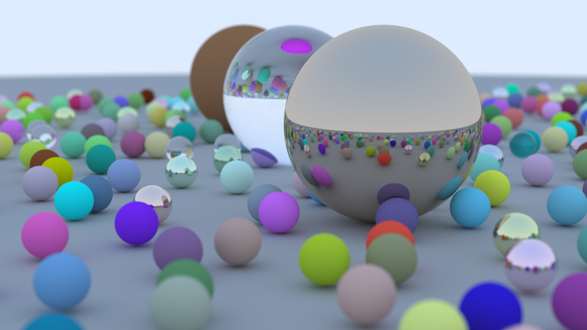

# Path Tracing

Experimenting with Path Tracing in the ~~Rust~~ Crab programming language.

This repo is following the [Ray Tracing in One Weekend](https://raytracing.github.io/books/RayTracingInOneWeekend.html) tutorial. The original was written in C++, so this is an interpretation of it.

I recommend compiling in release profile to render faster. I also recommend PGO since even with multithreading, it is not very fast.

The output is in `PPM` format. It should be trivial to rewrite it to use `SDL` instead. Though, it is quite slow and definitely not real-time, so it seems pointless currently.
